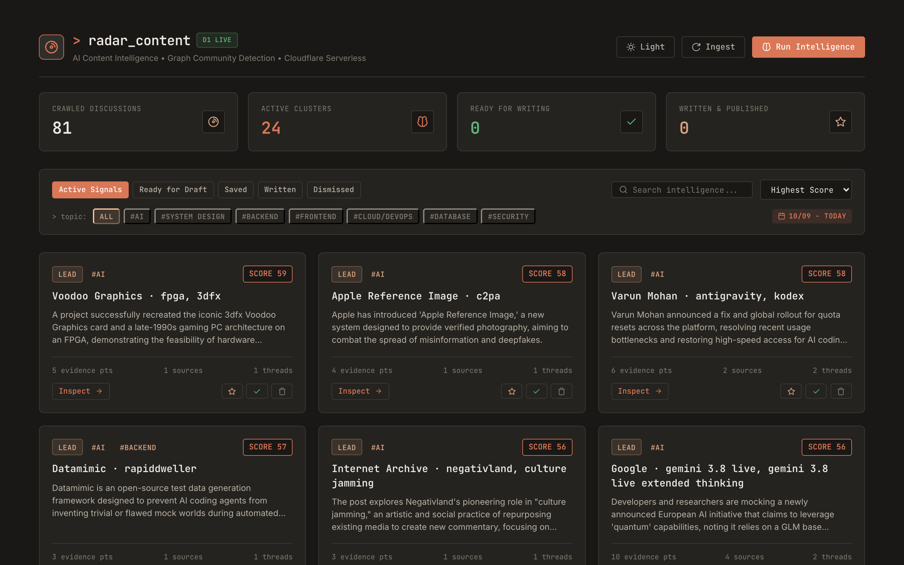

<p align="center">
  
</p>

<h1 align="center">📡 Radar Content</h1>

<p align="center">
  <b>AI-powered Content Intelligence Dashboard — zero-cost, serverless, self-hosted.</b>
</p>

<p align="center">
  <a href="#features">Features</a> •
  <a href="#architecture">Architecture</a> •
  <a href="#getting-started">Getting Started</a> •
  <a href="#tech-stack">Tech Stack</a>
</p>

---

## Overview

**Radar Content** is a self-hosted content intelligence system that automatically crawls, analyzes, and scores tech discussions from multiple sources (Reddit, Hacker News, X/Twitter, tech blogs). Instead of just summarizing articles, it **extracts structured arguments** — evidence, counterpoints, context — and **clusters related discussions** using graph algorithms to surface the most valuable insights for content creation.

**Key differentiator:** Unlike traditional RSS readers or news aggregators, Radar Content uses LLM-powered structured extraction and the **Leiden community detection algorithm** to connect fragmented discussions across platforms into unified, scored intelligence cards.

### Why?

- **Information overload is real.** Hundreds of AI/tech posts appear daily across Reddit, HN, X, and blogs.
- **Signal > Noise.** Most aggregators dump raw feeds. Radar Content extracts *structured evidence* and *counterarguments*, not just summaries.
- **Content creators need actionable intel.** Each card tells you: *What happened? What's the proof? Who disagrees? Is it worth writing about?*
- **Zero cost.** Runs entirely on Cloudflare's generous free tier + Gemini API's daily free quota.

## Features

- 🕷️ **Multi-source Crawling** — Reddit, Hacker News, X/Twitter, RSS feeds from tech blogs
- 🧠 **LLM Structured Extraction** — Breaks down each piece of content into `Summary`, `Evidence`, `Counter`, `Context`, and `Verification Questions`
- 🔗 **Knowledge Graph & Leiden Clustering** — Groups related discussions across platforms into unified topic cards
- 📊 **Intelligent Scoring** — Ranks cards by source credibility, evidence density, and community engagement
- 🏷️ **Content Workflow Management** — Status labels (`LEAD`, `READY`, `SAVED`, `WRITTEN`, `DISMISSED`) to track your content pipeline
- 🔍 **Topic Filtering** — Filter by categories like `AI`, `System Design`, `Backend`, `Frontend`
- ⏰ **Automated Cron Ingestion** — Runs every 15–30 minutes via Cloudflare Workers Cron Triggers
- 💰 **Zero-cost Architecture** — Cloudflare Workers + D1 + Pages + Gemini API free tier

## Architecture

```
┌──────────────────────────────────────────────────────────────────┐
│                        CLOUDFLARE EDGE                           │
│                                                                  │
│  ┌─────────────┐    ┌──────────────┐    ┌──────────────────┐    │
│  │ Cron Trigger │───▶│   Workers    │───▶│   Queues/Jobs    │    │
│  │ (15-30 min)  │    │  (Hono API)  │    │  (Rate Limiter)  │    │
│  └─────────────┘    └──────┬───────┘    └───────┬──────────┘    │
│                            │                     │               │
│                            ▼                     ▼               │
│  ┌─────────────────────────────────────────────────────────┐    │
│  │                     D1 Database                          │    │
│  │  ┌──────────┐ ┌────────────┐ ┌───────────┐ ┌─────────┐ │    │
│  │  │ articles │ │  entities  │ │  clusters │ │  edges  │ │    │
│  │  └──────────┘ └────────────┘ └───────────┘ └─────────┘ │    │
│  └─────────────────────────────────────────────────────────┘    │
│                            │                                     │
│                            ▼                                     │
│  ┌──────────────────────────────────────────┐                   │
│  │         Cloudflare Pages (Frontend)       │                   │
│  │         Card-based Dashboard UI           │                   │
│  └──────────────────────────────────────────┘                   │
└──────────────────────────────────────────────────────────────────┘
         │                                    │
         ▼                                    ▼
  ┌──────────────┐                   ┌─────────────────┐
  │  Data Sources │                   │  Google Gemini   │
  │  Reddit, HN,  │                   │  API (Flash)     │
  │  X, RSS Feeds │                   │  Free Daily Quota│
  └──────────────┘                   └─────────────────┘
```

## Tech Stack

| Layer | Technology | Cost |
|---|---|---|
| **Runtime** | Cloudflare Workers (TypeScript) | Free (100K req/day) |
| **Database** | Cloudflare D1 (SQLite edge) | Free (5M reads, 100K writes/day) |
| **Queue** | Cloudflare Queues | Free (100K messages/day) |
| **Frontend** | Cloudflare Pages (Vite + React) | Free |
| **LLM** | Google Gemini API (Flash) | Free daily quota |
| **Graph Algorithm** | Leiden (TypeScript impl) | N/A |

## Getting Started

### Prerequisites

- [Node.js](https://nodejs.org/) >= 20
- [Wrangler CLI](https://developers.cloudflare.com/workers/wrangler/) (`npm install -g wrangler`)
- A [Cloudflare account](https://dash.cloudflare.com/sign-up) (free tier)
- A [Google AI Studio API key](https://aistudio.google.com/apikey) (free)

### Local Development

```bash
# Clone the repository
git clone https://github.com/tcdtist/radar-content.git
cd radar-content

# Install dependencies
npm install

# Set up environment variables
cp .dev.vars.example .dev.vars
# Edit .dev.vars and add your GEMINI_API_KEY

# Initialize local D1 database schema
wrangler d1 execute radar-content-db --local --file=src/lib/db/schema.sql

# Run locally
npm run dev
```

### Deploy to Cloudflare

```bash
# Login to Cloudflare
wrangler login

# Create production D1 database
wrangler d1 create radar-content-db
# Copy the returned database_id into wrangler.toml under [[d1_databases]]

# Execute schema on production D1
wrangler d1 execute radar-content-db --remote --file=src/lib/db/schema.sql

# Set Gemini API key secret
wrangler secret put GEMINI_API_KEY

# Deploy Workers API
wrangler deploy

# Deploy Pages (frontend)
npm run build
wrangler pages deploy dist --project-name=radar-content
```

## Project Structure

```
radar-content/
├── src/
│   ├── workers/          # Cloudflare Workers entry points (api.ts, pipeline.ts)
│   ├── lib/              # Domain logic modules (db/, sources/, llm/, graph/, scoring/)
│   └── pages/            # Frontend dashboard (Vite + React 19 SPA)
├── tests/                # Vitest unit, integration, and E2E test suites
├── scripts/              # Crawler and verification automation scripts
├── .github/              # GitHub Actions CI/CD workflows
├── wrangler.toml         # Cloudflare Workers, D1, Queue & Cron bindings
├── package.json
└── README.md
```

## License
 
Distributed under the MIT License. See [LICENSE](LICENSE) for more information.

---

<p align="center">
  Built with ☁️ Cloudflare Workers, 🧠 Google Gemini, and 📊 Graph Intelligence.
</p>
